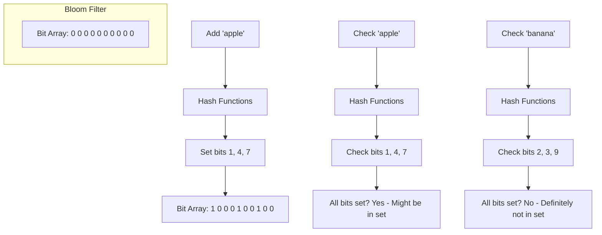
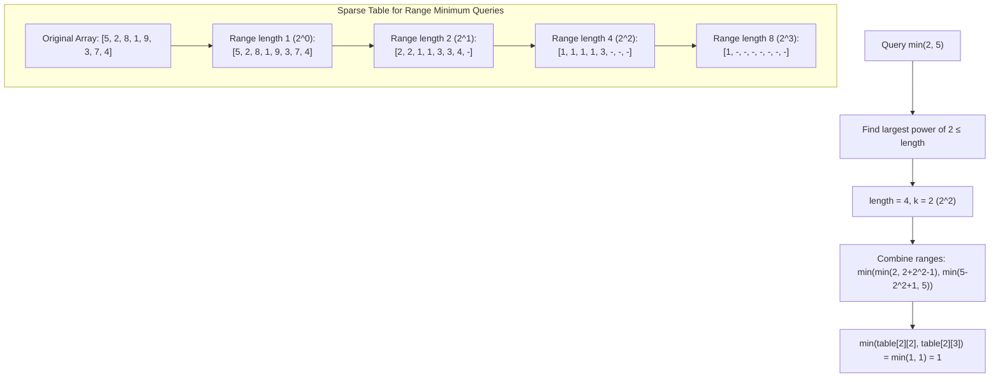

# Advanced Data Structures

This document covers advanced data structures that provide efficient solutions for specific types of problems.

## Bloom Filter

A Bloom filter is a space-efficient probabilistic data structure used to test whether an element is a member of a set.

### Explanation

Bloom filters allow you to quickly check if an element might be in a set or is definitely not in the set. They may produce false positives (incorrectly reporting that an element is in the set) but never false negatives. This trade-off allows for very compact representation of sets, using significantly less memory than storing all elements.

### Visual Representation

### Time Complexity

| Operation | Time Complexity |
|-----------|----------------|
| Add       | O(k)           |
| Contains  | O(k)           |
| Union     | O(m)           |

Where:
- k is the number of hash functions
- m is the size of the bit array

### Space Complexity

O(m) where m is the size of the bit array. For a desired false positive rate p and n elements, optimal size is:

m = -n ln(p) / (ln(2)²)

### Implementation Notes

Our implementation:
- Automatically calculates optimal bit array size and number of hash functions
- Uses MurmurHash3 for efficient hashing
- Supports union operations and false positive rate calculation
- Allows custom hash functions

### External Resources

- [Bloom Filter - GeeksforGeeks](https://www.geeksforgeeks.org/bloom-filters-introduction-and-python-implementation/)
- [Bloom Filters by Example](https://llimllib.github.io/bloomfilter-tutorial/)
- [Interactive Bloom Filter Visualization](https://www.jasondavies.com/bloomfilter/)

## Sparse Table

A sparse table is a data structure that answers range queries efficiently, especially for static arrays.

### Explanation

Sparse tables precompute results for ranges of powers of two, allowing for O(1) queries for idempotent operations (like min, max, gcd) and O(log n) queries for non-idempotent operations (like sum). They're particularly useful when you have a static array with many range queries.

### Visual Representation

### Time Complexity

| Operation          | Time Complexity  |
|--------------------|-----------------|
| Construction       | O(n log n)      |
| Idempotent Query   | O(1)            |
| Non-idempotent Query | O(log n)      |

### Space Complexity

O(n log n) where n is the length of the array.

### Implementation Notes

Our implementation:
- Supports both idempotent and non-idempotent operations
- Optimizes query methods based on the operation type
- Provides validation methods for input ranges

### External Resources

- [Sparse Table - CP Algorithms](https://cp-algorithms.com/data_structures/sparse-table.html)
- [Range Queries with Sparse Table](https://www.geeksforgeeks.org/sparse-table/)
- [Sparse Table Tutorial](https://www.hackerearth.com/practice/notes/sparse-table/)

## Use Cases Comparison

| Data Structure | Best For | Advantages | Limitations |
|----------------|----------|------------|-------------|
| Bloom Filter | Membership testing with space constraints | Very space efficient, constant time operations | Cannot store actual elements, false positives possible |
| Sparse Table | Static range queries | O(1) query time for idempotent operations | Immutable array, O(n log n) preprocessing |
