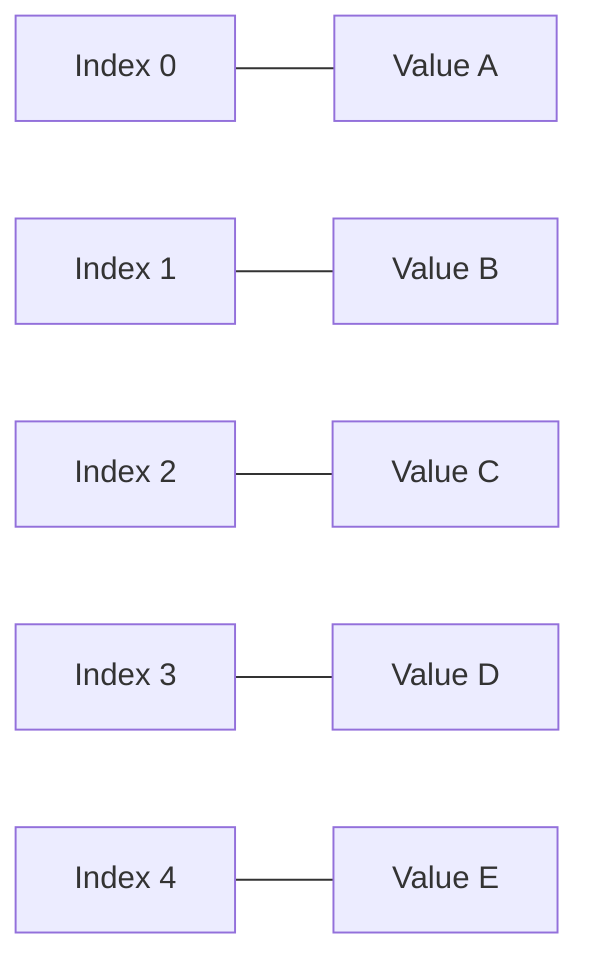
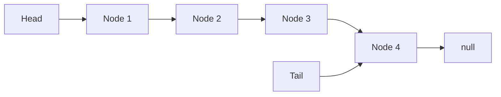
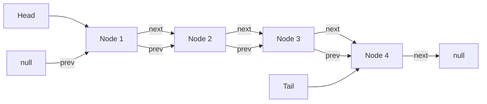
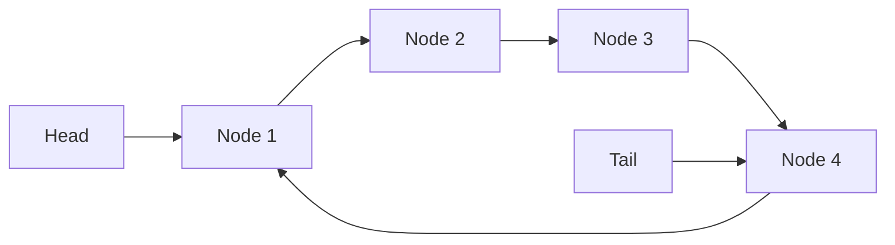
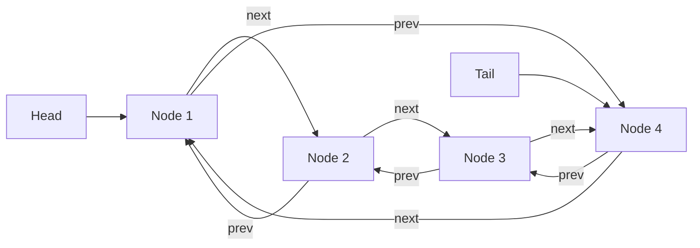

# Basic Data Structures

This document covers the fundamental data structures that serve as building blocks for more complex implementations.

## Array

An array is a collection of elements stored at contiguous memory locations, accessible by index.

### Explanation

Arrays store elements in adjacent memory locations, allowing for constant-time access to any element by its index. They offer efficient random access but have fixed size in many programming languages.

### Visual Representation

### Time Complexity

| Operation | Time Complexity |
|-----------|----------------|
| Access    | O(1)           |
| Search    | O(n)           |
| Insertion | O(n)           |
| Deletion  | O(n)           |

### Implementation Notes

Our Array implementation wraps Python's built-in list type and provides standard operations such as append and remove.

### External Resources

- [Arrays - GeeksforGeeks](https://www.geeksforgeeks.org/array-data-structure/)
- [Arrays - Khan Academy](https://www.khanacademy.org/computing/computer-science/algorithms/sorting-algorithms/a/arrays-and-array-operations)

## Singly Linked List

A singly linked list is a linear data structure where each element points to the next element in the sequence.

### Explanation

Singly linked lists consist of nodes that contain a value and a reference to the next node. The list has a head reference pointing to the first node and often a tail reference pointing to the last node for efficient append operations.

### Visual Representation

### Time Complexity

| Operation         | Time Complexity |
|-------------------|----------------|
| Access            | O(n)           |
| Search            | O(n)           |
| Insertion at head | O(1)           |
| Insertion at tail | O(1)           |
| Deletion at head  | O(1)           |
| Deletion at tail  | O(n)           |

### Implementation Notes

Our implementation includes both head and tail pointers to optimize append operations. It supports operations like append, prepend, remove, and traverse.

### External Resources

- [Linked Lists - GeeksforGeeks](https://www.geeksforgeeks.org/data-structures/linked-list/)
- [Linked Lists - Visualgo](https://visualgo.net/en/list)

## Doubly Linked List

A doubly linked list is similar to a singly linked list, but each node has references to both the next and previous nodes.

### Explanation

Doubly linked lists allow for bidirectional traversal by maintaining references to both the next and previous nodes. This enables more efficient operations at the cost of additional memory for the extra references.

### Visual Representation

### Time Complexity

| Operation         | Time Complexity |
|-------------------|----------------|
| Access            | O(n)           |
| Search            | O(n)           |
| Insertion at head | O(1)           |
| Insertion at tail | O(1)           |
| Deletion at head  | O(1)           |
| Deletion at tail  | O(1)           |
| Deletion at index | O(n)           |

### Implementation Notes

Our doubly linked list implementation optimizes lookups by approaching from either the head or tail, whichever is closer to the target index.

### External Resources

- [Doubly Linked List - GeeksforGeeks](https://www.geeksforgeeks.org/doubly-linked-list/)
- [Doubly Linked List - Programiz](https://www.programiz.com/dsa/doubly-linked-list)

## Circular Linked List

A circular linked list is a variation of a linked list where the last node points back to the first node, creating a circle.

### Explanation

In a circular linked list, there is no "end" - the last node points back to the first node. This structure is useful for applications where it's necessary to cycle through all elements repeatedly.

### Visual Representation

### Time Complexity

| Operation         | Time Complexity |
|-------------------|----------------|
| Access            | O(n)           |
| Search            | O(n)           |
| Insertion at head | O(1)           |
| Insertion at tail | O(1)           |
| Deletion          | O(n)           |
| Rotation          | O(1)           |

### Implementation Notes

Our circular linked list implementation includes a special `rotate` method that shifts the start/end positions, which is especially efficient in this data structure.

### External Resources

- [Circular Linked List - GeeksforGeeks](https://www.geeksforgeeks.org/circular-linked-list/)
- [Circular Linked List - Programiz](https://www.programiz.com/dsa/circular-linked-list)

## Circular Doubly Linked List

A circular doubly linked list combines features of both doubly linked lists and circular linked lists.

### Explanation

This structure allows bidirectional traversal with no defined start or end. The last node's next reference points to the first node, and the first node's previous reference points to the last node.

### Visual Representation

### Time Complexity

| Operation         | Time Complexity |
|-------------------|----------------|
| Access            | O(n)           |
| Search            | O(n)           |
| Insertion at head | O(1)           |
| Insertion at tail | O(1)           |
| Deletion          | O(n)           |
| Bidirectional rotation | O(1)      |

### Implementation Notes

Our implementation optimizes element lookup by traversing from the head or tail based on which is closer to the target index. It also provides efficient rotation in both directions.

### External Resources

- [Circular Doubly Linked List - GeeksforGeeks](https://www.geeksforgeeks.org/doubly-circular-linked-list-set-1-introduction-and-insertion/)
- [Circular Doubly Linked List Implementation](https://www.techiedelight.com/implementation-of-circular-doubly-linked-list/)
