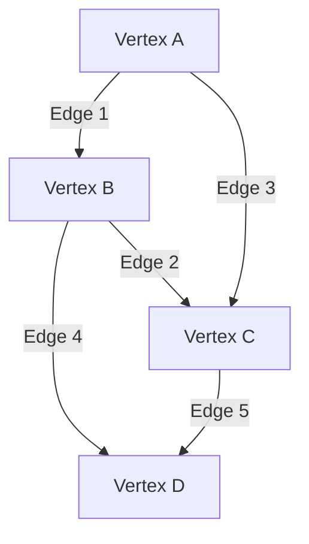

# Graph Data Structures

This document covers various graph data structures, which represent relationships between objects using vertices (nodes) and edges.

## Graph

A graph is a non-linear data structure consisting of vertices (nodes) and edges that connect these vertices. It can be either directed (edges have a direction) or undirected (edges are bidirectional).

### Properties
1. Consists of vertices (nodes) and edges
2. Can be directed or undirected
3. Supports weighted edges
4. Allows cycles and self-loops
5. Can be connected or disconnected

### Visual Representation



### Time Complexity

| Operation        | Average Case | Worst Case |
|-----------------|--------------|------------|
| Add Vertex      | O(1)         | O(1)       |
| Add Edge        | O(1)         | O(1)       |
| Remove Vertex   | O(V + E)     | O(V + E)   |
| Remove Edge     | O(1)         | O(1)       |
| Get Vertex      | O(1)         | O(1)       |
| Get Edge        | O(1)         | O(1)       |
| BFS/DFS         | O(V + E)     | O(V + E)   |
| Shortest Path   | O(V²)        | O(V²)      |

Where V is the number of vertices and E is the number of edges.

### Use Cases
- Social networks
- Computer networks
- Transportation systems
- Dependency graphs
- Game maps
- Web crawlers
- Compiler optimization
- Circuit design

### Example Usage
```python
from dsa import Graph

# Create an undirected graph
graph = Graph()

# Add vertices and edges
graph.add_edge("A", "B", 1.0)
graph.add_edge("B", "C", 2.0)
graph.add_edge("A", "C", 4.0)
graph.add_edge("B", "D", 3.0)
graph.add_edge("C", "D", 1.0)

# Get all vertices and edges
print(graph.get_vertices())  # ['A', 'B', 'C', 'D']
print(graph.get_edges())     # List of (from, to, weight) tuples

# Check if graph is connected
print(graph.is_connected())  # True

# Find shortest path
path = graph.get_shortest_path("A", "D")
print(path)  # ['A', 'B', 'D']

# Create a directed graph
directed_graph = Graph(directed=True)
directed_graph.add_edge("X", "Y")
directed_graph.add_edge("Y", "Z")
```

### Implementation Details
- Uses adjacency list representation
- Supports weighted edges
- Implements BFS and DFS traversal
- Uses Dijkstra's algorithm for shortest paths
- Handles both directed and undirected graphs
- Maintains vertex and edge relationships efficiently

### Advantages
1. Flexible representation of relationships
2. Efficient for sparse graphs
3. Easy to add/remove vertices and edges
4. Supports various graph algorithms
5. Memory efficient for sparse graphs

### Disadvantages
1. O(V + E) space complexity
2. Slower for dense graphs
3. More complex than simpler data structures
4. Not suitable for all types of data
5. Some operations can be expensive

### External Resources
- [Graph Data Structure - GeeksforGeeks](https://www.geeksforgeeks.org/graph-data-structure-and-algorithms/)
- [Graph Visualization](https://visualgo.net/en/graphds)
- [Graph Theory Tutorial](https://www.tutorialspoint.com/graph_theory/index.htm) 