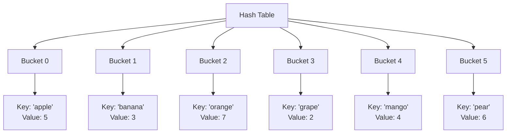

# Hash-Based Data Structures

This document covers various hash-based data structures, which use hash functions to map data to fixed-size values for efficient storage and retrieval.

## Hash Table

A hash table is a data structure that implements an associative array abstract data type, a structure that can map keys to values. It uses a hash function to compute an index into an array of buckets or slots, from which the desired value can be found.

### Properties
1. Uses a hash function to map keys to indices
2. Handles collisions through open addressing (linear probing)
3. Automatically resizes when load factor is exceeded
4. Supports any hashable key type
5. Maintains O(1) average-case time complexity for operations

### Visual Representation



### Time Complexity

| Operation   | Average Case | Worst Case |
|-------------|--------------|------------|
| Insertion   | O(1)         | O(n)       |
| Deletion    | O(1)         | O(n)       |
| Search      | O(1)         | O(n)       |
| Clear       | O(n)         | O(n)       |

### Use Cases
- Database indexing
- Caching systems
- Symbol tables in compilers
- Spell checkers
- Password hashing
- File systems
- Network routing tables

### Example Usage
```python
from dsa import HashTable

# Create a hash table
table = HashTable()

# Insert key-value pairs
table.insert("apple", 5)
table.insert("banana", 3)
table.insert("orange", 7)

# Get values
print(table.get("apple"))    # 5
print(table.get("banana"))   # 3
print(table.get("orange"))   # 7

# Check if key exists
print(table.contains("apple"))  # True
print(table.contains("grape"))  # False

# Delete a key-value pair
table.delete("banana")
print(table.contains("banana"))  # False

# Get all keys and values
print(table.keys())     # ['apple', 'orange']
print(table.values())   # [5, 7]
print(table.items())    # [('apple', 5), ('orange', 7)]
```

### Implementation Details
- Uses open addressing with linear probing for collision resolution
- Automatically resizes when load factor exceeds threshold (default: 0.75)
- Supports any hashable key type (integers, strings, floats, etc.)
- Maintains deleted node markers for proper probing
- Provides methods for bulk operations (keys, values, items)

### Advantages
1. O(1) average-case time complexity for operations
2. Flexible key types
3. Efficient for large datasets
4. Good for frequent lookups
5. Memory efficient for sparse data

### Disadvantages
1. O(n) worst-case time complexity
2. Not suitable for ordered data
3. Memory overhead for empty buckets
4. Performance degrades with high load factor
5. Hash function quality affects performance

### External Resources
- [Hash Table - GeeksforGeeks](https://www.geeksforgeeks.org/hashing-data-structure/)
- [Hash Table Visualizer](https://www.cs.usfca.edu/~galles/visualization/OpenHash.html)
- [Hash Table Tutorial](https://www.tutorialspoint.com/data_structures_algorithms/hash_table.htm) 