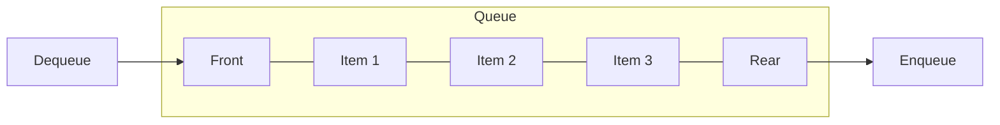
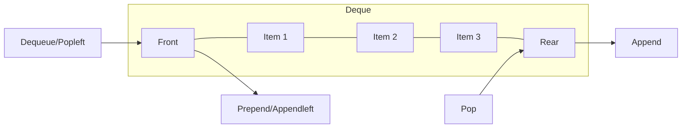
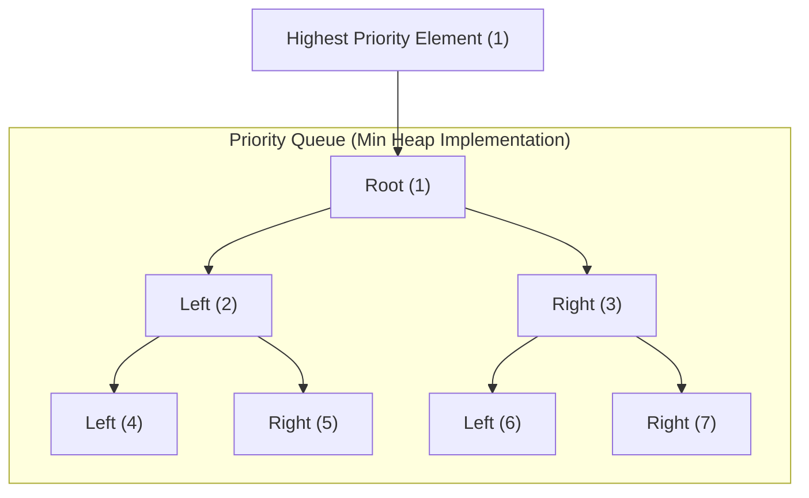
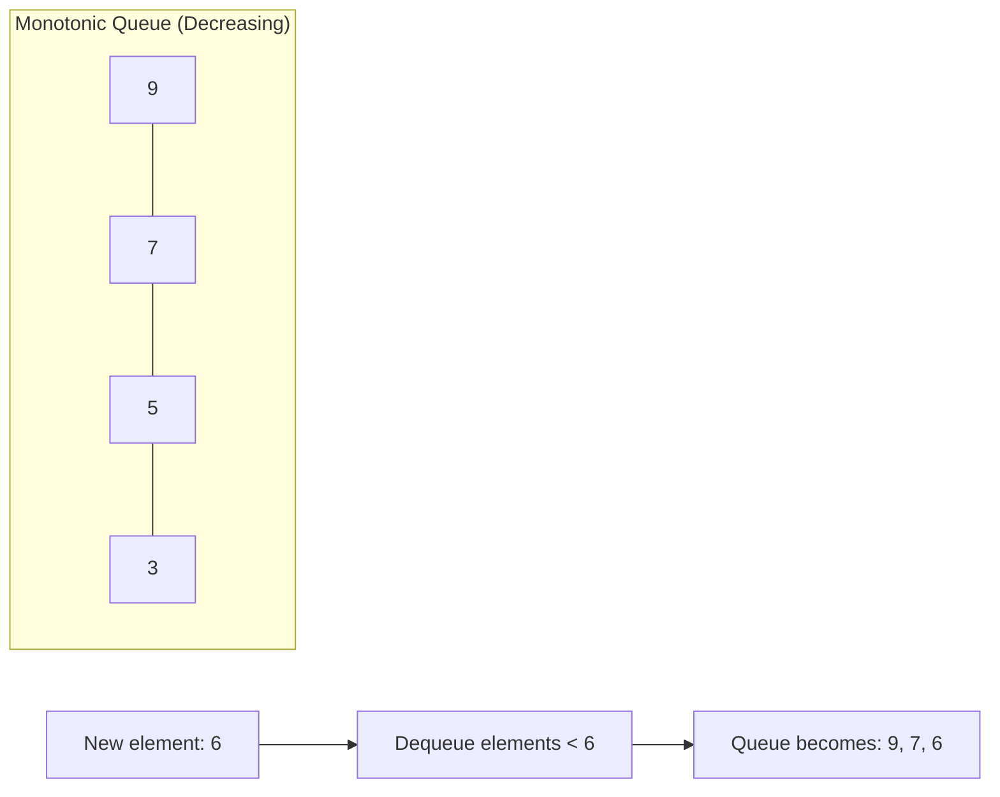

# Queue Data Structures

This document covers various queue-based data structures, which follow the First-In-First-Out (FIFO) principle where elements are added at the rear and removed from the front.

## Queue

A queue is a linear data structure that follows the FIFO (First In, First Out) principle.

### Explanation

Queues are used in scenarios where you need to process items in the exact order they arrive. Common applications include task scheduling, breadth-first search, and handling requests in web servers.

### Visual Representation

### Time Complexity

| Operation | Time Complexity |
|-----------|----------------|
| Enqueue   | O(1)           |
| Dequeue   | O(1)           |
| Peek      | O(1)           |
| Is Empty  | O(1)           |
| Search    | O(n)           |

### Implementation Notes

Our implementation uses Python's list with operations at both ends, ensuring constant time operations for both enqueue and dequeue.

### External Resources

- [Queue Data Structure - GeeksforGeeks](https://www.geeksforgeeks.org/queue-data-structure/)
- [Queue Animation - Visualgo](https://visualgo.net/en/list)
- [Queue Applications - Programiz](https://www.programiz.com/dsa/queue)

## Deque (Double-Ended Queue)

A deque (double-ended queue) is a queue-like data structure that supports insertion and removal from both ends.

### Explanation

Deques combine the features of stacks and queues, allowing efficient addition and removal of elements from either end. They're useful for algorithms like sliding window problems, palindrome checking, and work stealing in scheduling.

### Visual Representation

### Time Complexity

| Operation    | Time Complexity |
|--------------|----------------|
| Append       | O(1)           |
| Appendleft   | O(1)           |
| Pop          | O(1)           |
| Popleft      | O(1)           |
| Peek/Peekleft| O(1)           |
| Search       | O(n)           |

### Implementation Notes

Our implementation provides a well-balanced set of operations for both ends, making it versatile for different algorithmic needs.

### External Resources

- [Deque - GeeksforGeeks](https://www.geeksforgeeks.org/deque-set-1-introduction-applications/)
- [Deque in Competitive Programming](https://cp-algorithms.com/data_structures/stack_queue_modification.html)
- [Python's collections.deque Documentation](https://docs.python.org/3/library/collections.html#collections.deque)

## Priority Queue

A priority queue is a queue where elements have associated priorities and are served according to their priority rather than insertion order.

### Explanation

Priority queues serve elements based on their priority: higher priority elements are dequeued before lower priority ones. This is useful in scheduling algorithms, Dijkstra's shortest path, and any application where some items need to be processed before others.

### Visual Representation

### Time Complexity

| Operation             | Time Complexity |
|-----------------------|----------------|
| Insert with priority  | O(log n)       |
| Get highest priority  | O(1)           |
| Remove highest priority | O(log n)     |
| Change priority       | O(log n)       |

### Implementation Notes

Our priority queue is built on top of a min heap, which provides efficient priority-based operations. It also handles equal priorities by maintaining insertion order.

### External Resources

- [Priority Queue - GeeksforGeeks](https://www.geeksforgeeks.org/priority-queue-set-1-introduction/)
- [Priority Queue Applications](https://www.geeksforgeeks.org/applications-of-priority-queue/)
- [Visualizing Priority Queues](https://visualgo.net/en/heap)

## Monotonic Queue

A monotonic queue is a data structure that maintains elements in monotonic order (either increasing or decreasing).

### Explanation

Monotonic queues maintain elements in a specific order (non-increasing or non-decreasing) while supporting efficient queries for minimum or maximum values. They're particularly useful for sliding window problems where you need to find the maximum or minimum element in a window as it slides through an array.

### Visual Representation

### Time Complexity

| Operation             | Time Complexity |
|-----------------------|----------------|
| Enqueue               | O(1) amortized |
| Dequeue               | O(1)           |
| Get min/max           | O(1)           |
| Sliding window min/max| O(n) for n elements|

### Implementation Notes

Our implementation:
- Supports both increasing (for minimum) and decreasing (for maximum) modes
- Uses an efficient deque-based approach with amortized O(1) operations
- Handles duplicate values properly with a count dictionary

### External Resources

- [Monotonic Queue - LeetCode Discussion](https://leetcode.com/problems/sliding-window-maximum/discuss/65884/java-on-solution-using-deque-with-explanation)
- [Monotonic Queue Explained](https://medium.com/@gregsh9.5/monotonic-queue-notes-980a019d5793)
- [Sliding Window Algorithm with Monotonic Queue](https://www.nayuki.io/page/sliding-window-minimum-maximum-algorithm)
