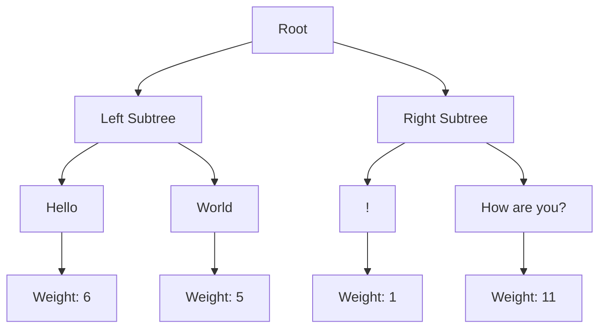

# Rope Data Structure

A Rope is a data structure designed for efficient manipulation of large strings. It provides O(log n) time complexity for split and concatenate operations, making it ideal for text editors and other applications that require frequent string modifications.

## Overview

A Rope is a binary tree where each leaf node contains a substring of the text, and internal nodes contain the total length of all text in their left subtree. This structure allows for efficient string operations without copying large portions of text.

### Properties

- O(log n) split and concatenate operations
- O(log n) insert and delete operations
- O(log n) substring operations
- Efficient for large texts
- Memory efficient
- Self-balancing structure

## Visual Representation



## Time Complexity

| Operation | Time Complexity |
|-----------|-----------------|
| Insert | O(log n) |
| Delete | O(log n) |
| Split | O(log n) |
| Concatenate | O(log n) |
| Substring | O(log n + k) |
| Length | O(1) |

## Use Cases

1. **Text Editors**
   - Efficient text insertion and deletion
   - Fast cursor movement
   - Undo/redo operations
   - Large file handling

2. **String Processing**
   - DNA sequence manipulation
   - Large text file processing
   - Document editing
   - Version control systems

3. **Data Structures**
   - Dynamic string arrays
   - Text buffers
   - String collections
   - Document databases

4. **Applications**
   - Code editors
   - Word processors
   - Text analysis tools
   - Log processing

## Example Usage

```python
from dsa import Rope

# Create a rope
rope = Rope("Hello World!")

# Insert text
rope.insert(6, "Beautiful ")

# Delete text
rope.delete(0, 6)  # Remove "Hello "

# Get substring
substring = rope.substring(0, 8)  # "Beautiful"

# Convert to string
text = str(rope)  # "Beautiful World!"
```

## Implementation Details

The Rope implementation includes:

1. **Node Structure**
   - Text content
   - Weight (left subtree size)
   - Left and right children
   - Parent reference
   - Height and size information

2. **Core Operations**
   - Split and concatenate
   - Insert and delete
   - Substring extraction
   - String conversion

3. **Optimizations**
   - Self-balancing tree
   - Efficient metadata updates
   - Memory-efficient storage

## Advantages

1. **Performance**
   - O(log n) operations
   - Efficient for large texts
   - Fast string manipulation

2. **Memory Efficiency**
   - No large string copies
   - Shared subtrees
   - Efficient storage

3. **Flexibility**
   - Supports all string operations
   - Easy to extend
   - Good for concurrent operations

## Disadvantages

1. **Overhead**
   - Tree structure overhead
   - Node management
   - Memory fragmentation

2. **Complexity**
   - Complex implementation
   - Hard to understand
   - Difficult to debug

3. **Cache Efficiency**
   - Less cache-friendly
   - More pointer chasing
   - Higher memory access

## External Resources

1. [Rope Data Structure on Wikipedia](https://en.wikipedia.org/wiki/Rope_(data_structure))
2. [Rope Implementation Guide](https://www.cs.rit.edu/~std3246/thesis/node14.html)
3. [Rope Visualization](https://visualgo.net/en/rope) 