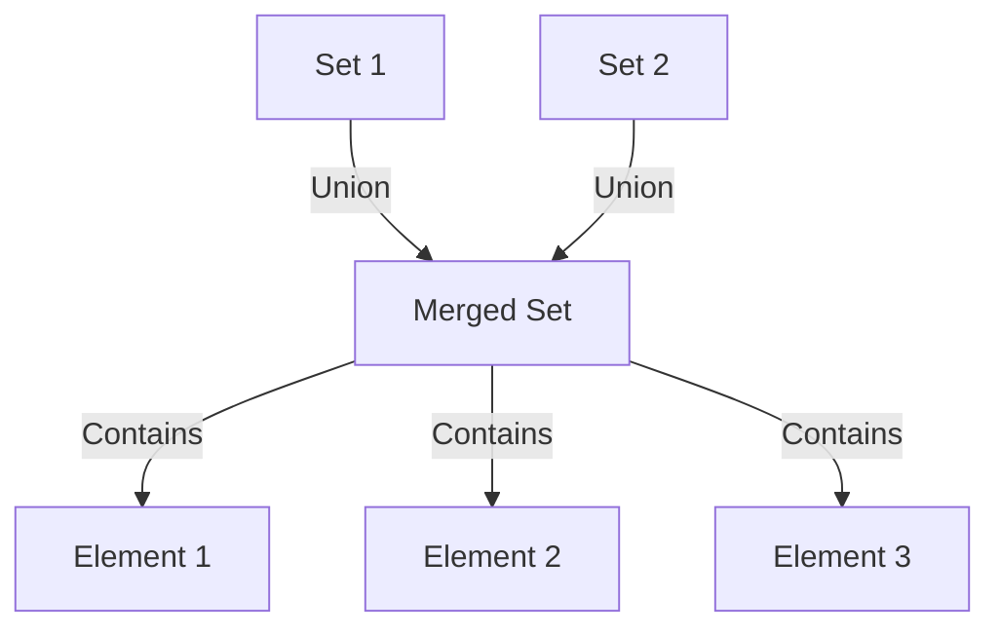

# Set Data Structures

This document covers various set data structures, which are used to store and manipulate collections of unique elements.

## Disjoint Set (Union-Find)

A Disjoint Set (also known as Union-Find) is a data structure that efficiently tracks a partition of a set into disjoint subsets. It provides near-constant time operations for two main functions:
- Finding which subset a particular element is in
- Joining two subsets into a single subset

### Properties
1. Maintains a collection of disjoint sets
2. Each set has a representative element
3. Supports efficient union and find operations
4. Uses path compression and union by rank optimizations
5. Allows tracking set sizes

### Visual Representation



### Time Complexity

| Operation     | Average Case | Worst Case |
|--------------|--------------|------------|
| Make Set     | O(1)         | O(1)       |
| Find         | α(n)         | O(log n)   |
| Union        | α(n)         | O(log n)   |
| Is Connected | α(n)         | O(log n)   |

Where α(n) is the inverse Ackermann function, which grows extremely slowly and is practically constant for all reasonable values of n.

### Use Cases
- Kruskal's algorithm for minimum spanning trees
- Connected components in graphs
- Network connectivity
- Image processing
- Maze generation
- Game development (e.g., connected regions)
- Social network analysis

### Example Usage
```python
from dsa import DisjointSet

# Create a disjoint set
ds = DisjointSet()

# Add elements to separate sets
ds.make_set("A")
ds.make_set("B")
ds.make_set("C")
ds.make_set("D")

# Check initial sets
print(ds.get_sets())  # [{'A'}, {'B'}, {'C'}, {'D'}]

# Union some sets
ds.union("A", "B")
ds.union("C", "D")

# Check updated sets
print(ds.get_sets())  # [{'A', 'B'}, {'C', 'D'}]

# Check connectivity
print(ds.is_connected("A", "B"))  # True
print(ds.is_connected("A", "C"))  # False

# Get set sizes
print(ds.get_set_size("A"))  # 2
print(ds.get_set_size("C"))  # 2
```

### Implementation Details
- Uses path compression for efficient find operations
- Implements union by rank to maintain balanced trees
- Tracks set sizes for additional functionality
- Supports any hashable element type
- Maintains parent and rank relationships

### Advantages
1. Near-constant time complexity for operations
2. Memory efficient
3. Simple to implement
4. Versatile applications
5. Supports dynamic set operations

### Disadvantages
1. Cannot split sets once merged
2. No direct way to enumerate elements in a set
3. Requires additional space for rank tracking
4. Not suitable for all types of data
5. Some operations may be slower in worst case

### External Resources
- [Disjoint Set Data Structure - GeeksforGeeks](https://www.geeksforgeeks.org/disjoint-set-data-structures/)
- [Union-Find Algorithm - Wikipedia](https://en.wikipedia.org/wiki/Disjoint-set_data_structure)
- [Visualization of Union-Find](https://visualgo.net/en/ufds) 