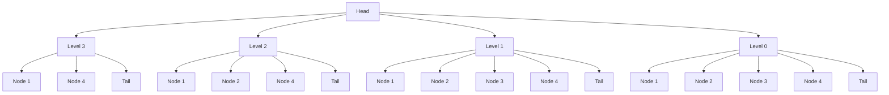

# Skip List Data Structure

A Skip List is a probabilistic data structure that provides O(log n) average case complexity for search, insert, and delete operations. It was invented by William Pugh in 1989 as an alternative to balanced trees.

## Overview

A Skip List is a linked list with multiple levels, where each level is a subset of the level below it. The bottom level contains all elements, while each higher level contains fewer elements, creating a "skip" effect that allows for faster traversal.

### Properties

- O(log n) average case complexity for operations
- O(n) worst case complexity
- O(n) space complexity
- Probabilistic balancing
- Supports duplicate keys
- Simpler to implement than balanced trees
- Self-balancing through randomization

## Visual Representation



## Time Complexity

| Operation | Average Case | Worst Case |
|-----------|--------------|------------|
| Search    | O(log n)     | O(n)       |
| Insert    | O(log n)     | O(n)       |
| Delete    | O(log n)     | O(n)       |
| Get Min   | O(1)         | O(1)       |
| Get Max   | O(n)         | O(n)       |

## Use Cases

1. **Database Indexing**
   - Used in some database systems for indexing
   - Provides efficient range queries
   - Supports concurrent operations

2. **Priority Queues**
   - Can be used to implement priority queues
   - Supports efficient insertion and deletion
   - Maintains sorted order

3. **Cache Implementation**
   - Used in some cache implementations
   - Provides O(log n) lookup time
   - Supports efficient updates

4. **Concurrent Data Structures**
   - Natural support for concurrent operations
   - Lock-free implementations possible
   - Used in concurrent programming

## Example Usage

```python
from dsa import SkipList

# Create a skip list
skip_list = SkipList()

# Insert elements
skip_list.insert(3, "three")
skip_list.insert(1, "one")
skip_list.insert(4, "four")
skip_list.insert(2, "two")

# Search for elements
print(skip_list.search(2))  # Output: "two"
print(skip_list.search(5))  # Output: None

# Delete elements
skip_list.delete(2)

# Get min and max
print(skip_list.get_min())  # Output: "one"
print(skip_list.get_max())  # Output: "four"

# Dictionary-like operations
skip_list[5] = "five"  # Insert
print(skip_list[5])    # Get
del skip_list[5]       # Delete
```

## Implementation Details

The Skip List implementation includes:

1. **Node Structure**
   - Key and value storage
   - Array of forward pointers
   - Level information

2. **Core Operations**
   - Insert: O(log n) average case
   - Search: O(log n) average case
   - Delete: O(log n) average case
   - Get Min/Max: O(1)/O(n)

3. **Optimizations**
   - Random level generation
   - Sentinel nodes (head and tail)
   - Efficient pointer updates

## Advantages

1. **Simplicity**
   - Easier to implement than balanced trees
   - More intuitive understanding
   - Less code maintenance

2. **Performance**
   - O(log n) average case operations
   - Good cache utilization
   - Efficient for many use cases

3. **Flexibility**
   - Supports duplicate keys
   - Easy to modify for specific needs
   - Good for concurrent operations

## Disadvantages

1. **Space Usage**
   - O(n) space complexity
   - Extra pointers for levels
   - Memory overhead

2. **Worst Case**
   - O(n) worst case complexity
   - Unbalanced structure possible
   - Performance depends on randomization

3. **Randomization**
   - Requires random number generation
   - Non-deterministic structure
   - May affect reproducibility

## External Resources

1. [Skip List on Wikipedia](https://en.wikipedia.org/wiki/Skip_list)
2. [Skip List Visualization](https://www.cs.usfca.edu/~galles/visualization/SkipList.html)
3. [Original Skip List Paper](https://dl.acm.org/doi/10.1145/78973.78977) 