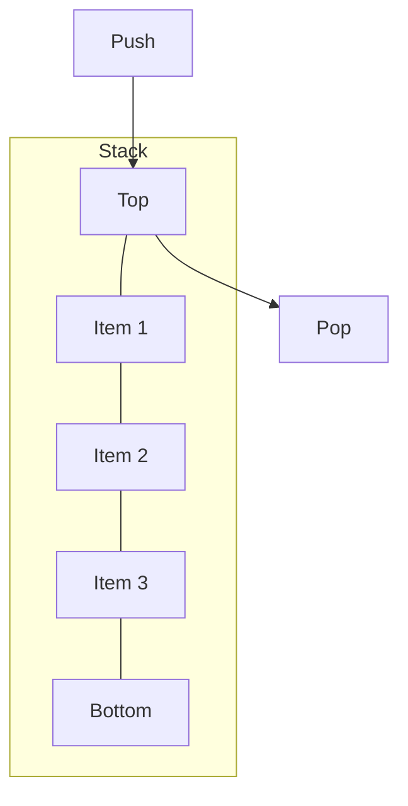
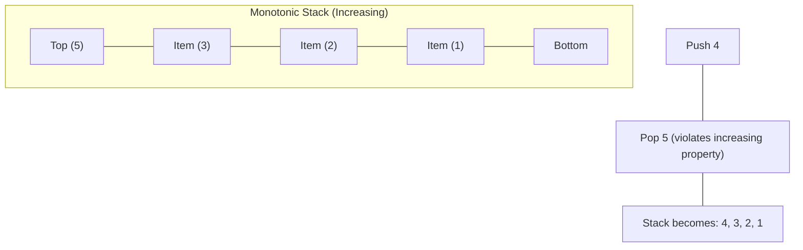

# Stack Data Structures

This document covers stack-based data structures, which follow the Last-In-First-Out (LIFO) principle where elements are added and removed from the same end.

## Stack

A stack is a linear data structure that follows the LIFO (Last In, First Out) principle.

### Explanation

Stacks are used when you need to access elements in the reverse order of their addition. Common applications include function call management (call stack), expression evaluation, backtracking algorithms, and undo mechanisms in applications.

### Visual Representation



### Time Complexity

| Operation | Time Complexity |
|-----------|----------------|
| Push      | O(1)           |
| Pop       | O(1)           |
| Peek      | O(1)           |
| Is Empty  | O(1)           |
| Search    | O(n)           |

### Implementation Notes

Our implementation uses Python's list for simplicity and efficiency, with additions and removals happening only at one end (the top of the stack).

### External Resources

- [Stack Data Structure - GeeksforGeeks](https://www.geeksforgeeks.org/stack-data-structure/)
- [Stack Visualization - Visualgo](https://visualgo.net/en/list)
- [Stack Applications - Programiz](https://www.programiz.com/dsa/stack)

## Monotonic Stack

A monotonic stack is a stack that maintains elements in a monotonic order (either strictly increasing or strictly decreasing).

### Explanation

Monotonic stacks are useful for problems requiring finding the "next greater/smaller element" or "previous greater/smaller element" for each element in an array. They maintain their monotonic property by popping elements that would violate the order before pushing new elements.

### Visual Representation



### Time Complexity

| Operation            | Time Complexity |
|----------------------|----------------|
| Push                 | O(1) amortized |
| Pop                  | O(1)           |
| Get min/max          | O(1)           |
| Next greater element | O(n) for n elements |

### Implementation Notes

Our implementation:
- Supports both increasing (for min tracking) and decreasing (for max tracking) modes
- Handles edge cases like empty stacks and duplicate values
- Includes example usage for solving the "next greater element" problem

### External Resources

- [Monotonic Stack - LeetCode Discussion](https://leetcode.com/problems/next-greater-element-i/discuss/97595/java-10-lines-linear-time-complexity-on-with-explanation)
- [Monotonic Stack Problems](https://liuzhenglaichn.gitbook.io/algorithm/monotonic-stack)
- [Monotonic Stack Tutorial](https://medium.com/@vishnuvardhan623/monotonic-stack-e9dcc4fa8c38)

### Applications of Monotonic Stack

The monotonic stack is particularly useful for solving:

1. Next/Previous Greater/Smaller Element problems
2. Largest Rectangle in Histogram
3. Maximum of minimum for every window size
4. Stock Span Problem
5. Trapping Rain Water problem

### Example: Finding Next Greater Element

A common application of a monotonic stack is finding the next greater element for each element in an array:

```python
def next_greater_element(arr):
    n = len(arr)
    result = [-1] * n  # Initialize with -1 (no greater element)
    stack = []  # Using a stack to track indices
    
    for i in range(n):
        # While stack is not empty and current element is greater than element at stack top
        while stack and arr[i] > arr[stack[-1]]:
            # Pop the top element and set its next greater element to the current element
            result[stack.pop()] = arr[i]
        
        # Push current index onto stack
        stack.append(i)
    
    return result
```

This algorithm has O(n) time complexity since each element is pushed and popped at most once.
