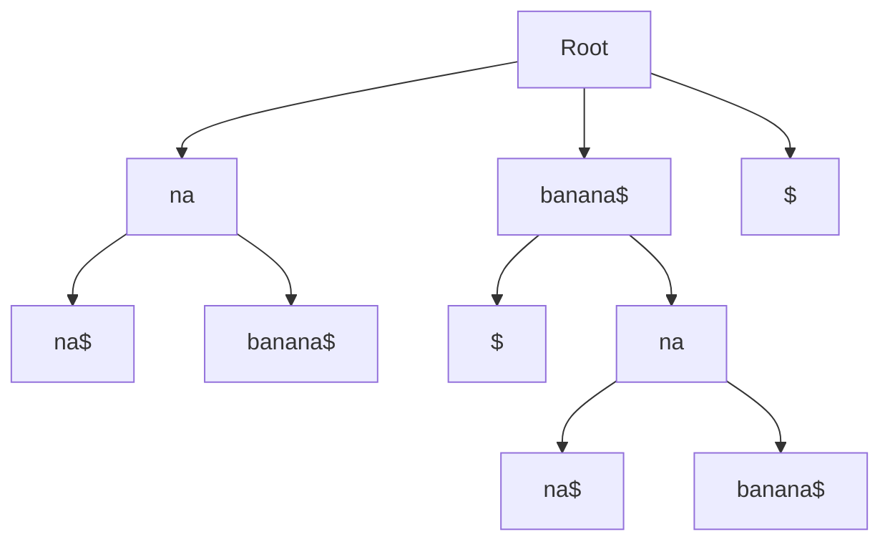

# Suffix Tree Data Structure

A Suffix Tree is a compressed trie containing all the suffixes of a given text. It provides O(m) pattern matching time complexity, where m is the pattern length. The suffix tree was invented by Peter Weiner in 1973 and later improved by Edward McCreight in 1976.

## Overview

A suffix tree is a tree-like data structure that represents all possible suffixes of a string. It is particularly useful for string pattern matching and various string processing applications.

### Properties

- O(n) space complexity
- O(m) pattern matching time complexity
- O(n) construction time (using Ukkonen's algorithm)
- Supports multiple pattern matching
- Efficient for string operations
- Compressed representation of all suffixes

## Visual Representation



## Time Complexity

| Operation | Time Complexity |
|-----------|-----------------|
| Construction | O(n) |
| Pattern Search | O(m) |
| Substring Count | O(n) |
| Longest Repeated Substring | O(n) |

## Use Cases

1. **Pattern Matching**
   - Fast substring search
   - Multiple pattern matching
   - DNA sequence matching
   - Text indexing

2. **String Analysis**
   - Finding repeated substrings
   - Finding palindromes
   - Finding common substrings
   - String compression

3. **Bioinformatics**
   - DNA sequence analysis
   - Protein sequence matching
   - Genome assembly
   - Sequence alignment

4. **Text Processing**
   - Text compression
   - Data mining
   - Information retrieval
   - Natural language processing

## Example Usage

```python
from dsa import SuffixTree

# Create a suffix tree
text = "banana"
suffix_tree = SuffixTree(text)

# Search for patterns
positions = suffix_tree.search("ana")
print(positions)  # Output: [1, 3]

# Count distinct substrings
count = suffix_tree.get_substring_count()
print(count)  # Output: 15

# Find longest repeated substring
longest = suffix_tree.get_longest_repeated_substring()
print(longest)  # Output: "ana"
```

## Implementation Details

The Suffix Tree implementation includes:

1. **Node Structure**
   - Start and end indices
   - Parent reference
   - Children dictionary
   - Suffix link
   - Leaf count

2. **Core Operations**
   - Tree construction (Ukkonen's algorithm)
   - Pattern searching
   - Substring counting
   - Longest repeated substring finding

3. **Optimizations**
   - Suffix links for faster traversal
   - Edge compression
   - Efficient space usage

## Advantages

1. **Performance**
   - O(m) pattern matching
   - Efficient for multiple patterns
   - Fast substring operations

2. **Space Efficiency**
   - Compressed representation
   - O(n) space complexity
   - Efficient for large texts

3. **Versatility**
   - Supports various string operations
   - Useful in many applications
   - Easy to extend

## Disadvantages

1. **Construction Time**
   - O(n) construction time
   - Complex implementation
   - Memory intensive during construction

2. **Space Usage**
   - Still requires significant space
   - Not suitable for very large texts
   - Memory overhead for links

3. **Complexity**
   - Complex to implement
   - Hard to understand
   - Difficult to maintain

## External Resources

1. [Suffix Tree on Wikipedia](https://en.wikipedia.org/wiki/Suffix_tree)
2. [Ukkonen's Algorithm](https://en.wikipedia.org/wiki/Ukkonen%27s_algorithm)
3. [Suffix Tree Visualization](https://visualgo.net/en/suffixtree) 