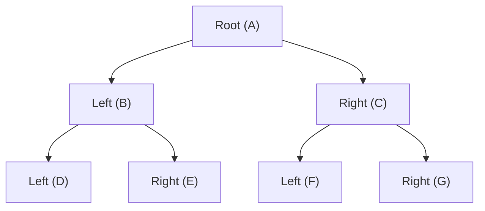
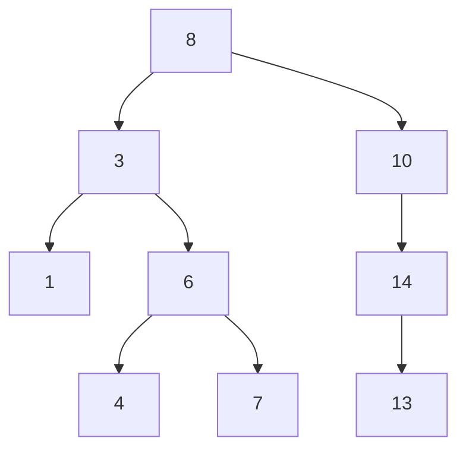
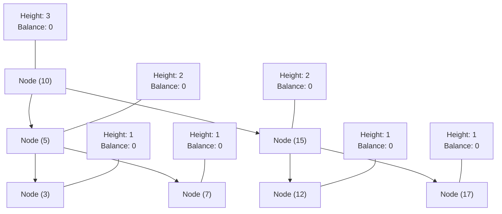
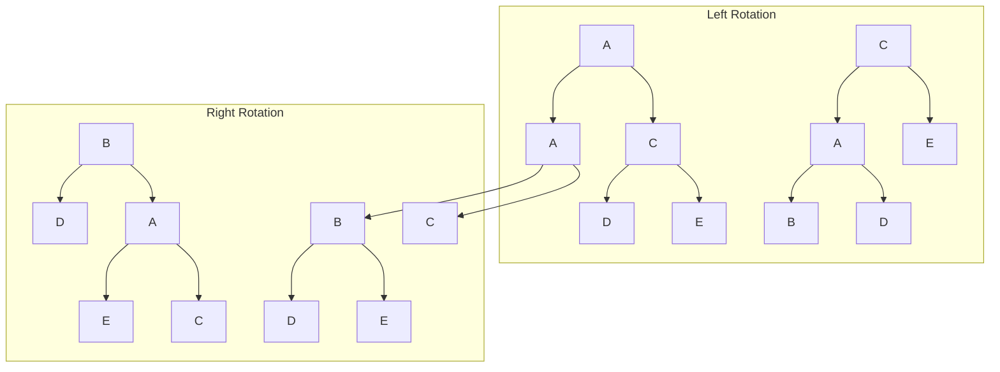
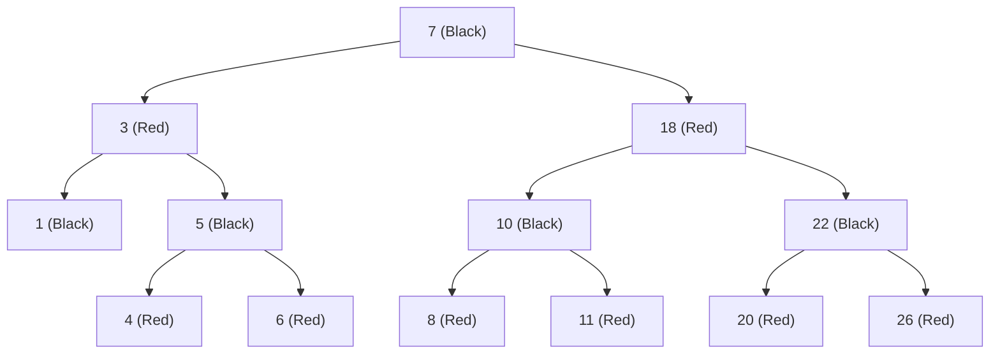
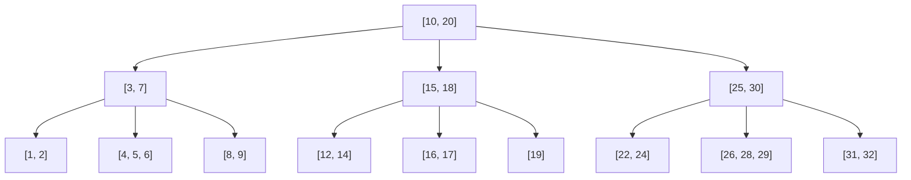

# Tree Data Structures

This document covers various tree data structures, which are hierarchical structures consisting of nodes with parent-child relationships.

## Binary Tree

A binary tree is a tree data structure where each node has at most two children, referred to as the left child and the right child.

### Explanation

Binary trees are fundamental tree structures where each node can have up to two children. Unlike binary search trees, binary trees don't have specific ordering requirements. They're used in various applications, including expression trees, Huffman coding, and as a base for other tree types.

### Visual Representation



### Tree Properties

Our implementation can test if a binary tree is:
- **Balanced**: Height difference between left and right subtrees for any node is at most 1
- **Full**: Each node has either 0 or 2 children
- **Perfect**: All internal nodes have 2 children and all leaves are at the same level
- **Complete**: All levels are filled except possibly the last, which is filled left-to-right

### Time Complexity

| Operation               | Time Complexity |
|-------------------------|----------------|
| Insertion               | O(n)           |
| Search                  | O(n)           |
| Traversal (any method)  | O(n)           |
| Height calculation      | O(n)           |

### Implementation Notes

The implementation supports multiple traversal methods:
- Level-order (breadth-first)
- Inorder (left-root-right)
- Preorder (root-left-right)
- Postorder (left-right-root)

### External Resources

- [Binary Tree - GeeksforGeeks](https://www.geeksforgeeks.org/binary-tree-data-structure/)
- [Binary Tree Visualizer](https://visualgo.net/en/bst)
- [Types of Binary Trees](https://www.programiz.com/dsa/binary-tree)

## Full Binary Tree

A full binary tree is a binary tree where every node has either 0 or 2 children.

### Explanation

In a full binary tree, each node either has no children (leaf node) or has two children. There are no nodes with exactly one child. This structure ensures optimal use of resources in certain algorithms.

### Visual Representation


### Time Complexity

| Operation               | Time Complexity |
|-------------------------|----------------|
| Insertion pair          | O(n) for finding parent + O(1) for insertion |
| Validation              | O(n)           |
| Traversal               | O(n)           |

### Implementation Notes

Our implementation enforces the "full" property by providing a special `insert_pair` method that adds both left and right children at once. It also includes validation to ensure the tree remains full.

### External Resources

- [Full Binary Tree - GeeksforGeeks](https://www.geeksforgeeks.org/full-binary-tree/)
- [Properties of Binary Trees](https://www.cs.cmu.edu/~adamchik/15-121/lectures/Trees/trees.html)

## Binary Search Tree

A binary search tree (BST) is a binary tree where the left subtree of a node contains only nodes with values less than the node's value, and the right subtree contains only nodes with values greater than the node's value.

### Explanation

Binary search trees provide efficient operations due to their ordering property. They support fast lookup, addition, and removal of items, and can be used to implement dynamic sets and lookup tables.

### Visual Representation



### Time Complexity

| Operation   | Average Case | Worst Case |
|-------------|--------------|------------|
| Search      | O(log n)     | O(n)       |
| Insertion   | O(log n)     | O(n)       |
| Deletion    | O(log n)     | O(n)       |
| Min/Max     | O(log n)     | O(n)       |
| Traversal   | O(n)         | O(n)       |

### Implementation Notes

Our BST implementation handles all three deletion cases:
1. Node with no children (leaf node)
2. Node with one child
3. Node with two children (using inorder successor)

### External Resources

- [Binary Search Tree - GeeksforGeeks](https://www.geeksforgeeks.org/binary-search-tree-data-structure/)
- [BST Visualizer](https://visualgo.net/en/bst)
- [Interactive BST](https://www.cs.usfca.edu/~galles/visualization/BST.html)

## AVL Tree

An AVL tree is a self-balancing binary search tree where the height difference between left and right subtrees of any node cannot exceed one.

### Explanation

Named after inventors Adelson-Velsky and Landis, AVL trees automatically maintain balance during insertions and deletions through rotations. They ensure O(log n) time complexity for all operations, preventing the worst-case scenario seen in regular BSTs.

### Visual Representation



### Rotation Types



### Time Complexity

| Operation   | Average Case | Worst Case |
|-------------|--------------|------------|
| Search      | O(log n)     | O(log n)   |
| Insertion   | O(log n)     | O(log n)   |
| Deletion    | O(log n)     | O(log n)   |
| Min/Max     | O(log n)     | O(log n)   |
| Traversal   | O(n)         | O(n)       |

### Implementation Notes

Our AVL tree implementation:
- Maintains a height attribute for each node
- Performs four types of rotations: Left, Right, Left-Right, Right-Left
- Rebalances the tree after each insertion and deletion
- Includes validation to ensure all AVL properties are maintained

### External Resources

- [AVL Tree - GeeksforGeeks](https://www.geeksforgeeks.org/avl-tree-set-1-insertion/)
- [AVL Tree Visualizer](https://www.cs.usfca.edu/~galles/visualization/AVLtree.html)
- [AVL Trees Tutorial](https://www.tutorialspoint.com/data_structures_algorithms/avl_tree_algorithm.htm)

## Red-Black Tree

A Red-Black Tree is a self-balancing binary search tree that maintains balance through node coloring. It ensures that the tree remains approximately balanced, providing O(log n) time complexity for all operations.

### Properties
1. Every node is either red or black
2. The root is black
3. All leaves (NIL) are black
4. If a node is red, then both its children are black
5. Every path from root to leaves contains the same number of black nodes

### Visual Representation



### Time Complexity

| Operation   | Time Complexity |
|-------------|----------------|
| Search      | O(log n)       |
| Insertion   | O(log n)       |
| Deletion    | O(log n)       |
| Min/Max     | O(log n)       |
| Traversal   | O(n)           |

### Use Cases
- Database indexing
- Memory management
- File systems
- Network routing tables
- Interval trees
- Order statistics

### Example Usage
```python
from dsa import RedBlackTree

# Create a Red-Black Tree
tree = RedBlackTree()

# Insert values
tree.insert(7)
tree.insert(3)
tree.insert(18)
tree.insert(10)
tree.insert(22)

# Search for values
print(tree.search(7))   # True
print(tree.search(15))  # False

# Get min and max
print(tree.get_min())   # 3
print(tree.get_max())   # 22

# Get sorted values
print(tree.inorder_traversal())  # [3, 7, 10, 18, 22]

# Delete a value
tree.delete(10)
print(tree.search(10))  # False
```

### Implementation Details
- Uses a sentinel node (NIL) to simplify boundary conditions
- Maintains color property during insertions and deletions
- Performs rotations to maintain balance
- Handles all three deletion cases:
  1. Node with no children
  2. Node with one child
  3. Node with two children

### Advantages
1. Guaranteed O(log n) time complexity for all operations
2. Self-balancing without explicit height tracking
3. More flexible than AVL trees (fewer rotations)
4. Good for frequently modified data
5. Efficient for both read and write operations

### Disadvantages
1. More complex implementation than basic BST
2. Additional memory overhead for color storage
3. Slightly slower than AVL trees for lookup operations
4. More complex deletion cases
5. Requires careful maintenance of color properties

### External Resources
- [Red-Black Tree - GeeksforGeeks](https://www.geeksforgeeks.org/red-black-tree-set-1-introduction-2/)
- [Red-Black Tree Visualizer](https://www.cs.usfca.edu/~galles/visualization/RedBlack.html)
- [Red-Black Tree Tutorial](https://www.tutorialspoint.com/data_structures_algorithms/red_black_tree_algorithm.htm)

## B-Tree

A B-Tree is a self-balancing tree data structure that maintains sorted data and allows searches, sequential access, insertions, and deletions in logarithmic time. It is particularly well-suited for systems that read and write large blocks of data, such as databases and file systems.

### Properties
1. Every node has at most 2t children
2. Every non-leaf node (except root) has at least t children
3. The root has at least 2 children if it is not a leaf
4. All leaves appear on the same level
5. A non-leaf node with k children contains k-1 keys

### Visual Representation



### Time Complexity

| Operation   | Time Complexity |
|-------------|----------------|
| Search      | O(log n)       |
| Insertion   | O(log n)       |
| Deletion    | O(log n)       |
| Min/Max     | O(log n)       |
| Traversal   | O(n)           |

### Use Cases
- Database indexing
- File systems
- Large-scale data storage
- Disk-based data structures
- Database management systems
- Operating system file systems

### Example Usage
```python
from dsa import BTree

# Create a B-Tree with minimum degree 2
tree = BTree(t=2)

# Insert values
tree.insert(7)
tree.insert(3)
tree.insert(18)
tree.insert(10)
tree.insert(22)

# Search for values
print(tree.search(7))   # True
print(tree.search(15))  # False

# Get min and max
print(tree.get_min())   # 3
print(tree.get_max())   # 22

# Get sorted values
print(tree.inorder_traversal())  # [3, 7, 10, 18, 22]

# Delete a value
tree.delete(10)
print(tree.search(10))  # False
```

### Implementation Details
- Uses a minimum degree parameter (t) to control node capacity
- Maintains sorted order of keys within nodes
- Performs node splitting and merging to maintain balance
- Handles all deletion cases:
  1. Deletion from a leaf node
  2. Deletion from a non-leaf node
  3. Deletion with key redistribution
  4. Deletion with node merging

### Advantages
1. Excellent for disk-based storage
2. Maintains balance automatically
3. Good for large datasets
4. Efficient for range queries
5. Well-suited for database systems

### Disadvantages
1. More complex than binary search trees
2. Overhead for maintaining multiple keys per node
3. Not as efficient for small datasets
4. More complex implementation
5. Requires careful handling of node splitting and merging

### External Resources
- [B-Tree - GeeksforGeeks](https://www.geeksforgeeks.org/b-tree-set-1-introduction-2/)
- [B-Tree Visualizer](https://www.cs.usfca.edu/~galles/visualization/BTree.html)
- [B-Tree Tutorial](https://www.tutorialspoint.com/data_structures_algorithms/b_tree_algorithm.htm)

## Trie (Prefix Tree)

A trie is a tree-like data structure used to store a dynamic set of strings, especially useful for prefix-based operations like autocomplete.

### Properties
- Each node represents a character in a string
- Path from root to a node represents a prefix
- Common prefixes share nodes
- End of words are marked with a special flag

### Time Complexity
- Insertion: O(m) where m is the length of the word
- Search: O(m) where m is the length of the word
- Prefix Search: O(p) where p is the length of the prefix
- Deletion: O(m) where m is the length of the word
- Space Complexity: O(ALPHABET_SIZE * m * n) where n is the number of words

### Use Cases
- Autocomplete systems
- Spell checkers
- IP routing tables
- Word games
- Dictionary implementations

### Example Usage
```python
from dsa import Trie

# Create a trie
trie = Trie()

# Insert words
trie.insert("hello")
trie.insert("world")
trie.insert("help")

# Search for words
print(trie.search("hello"))  # True
print(trie.search("help"))   # True
print(trie.search("world"))  # True
print(trie.search("hell"))   # False

# Check prefixes
print(trie.starts_with("he"))  # True
print(trie.starts_with("wo"))  # True
print(trie.starts_with("x"))   # False

# Get all words
print(trie.get_all_words())  # ['hello', 'help', 'world']

# Delete a word
trie.delete("help")
print(trie.search("help"))   # False
```

### Implementation Details
- Uses a dictionary to store children nodes for efficient character lookup
- Maintains a count of words for size tracking
- Supports prefix-based operations efficiently
- Handles duplicate words gracefully
- Provides methods for word collection and counting

### Advantages
1. Fast prefix-based operations
2. Space efficient for shared prefixes
3. Supports dynamic word sets
4. Easy to implement autocomplete
5. Good for dictionary applications

### Disadvantages
1. Memory intensive for non-shared prefixes
2. Not suitable for numerical data
3. Slower than hash tables for exact matches
4. Complex to implement compared to simpler structures
