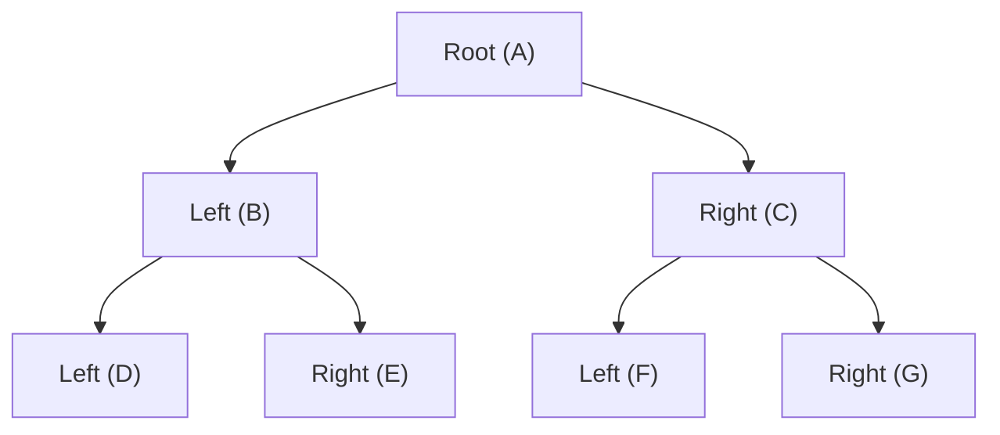
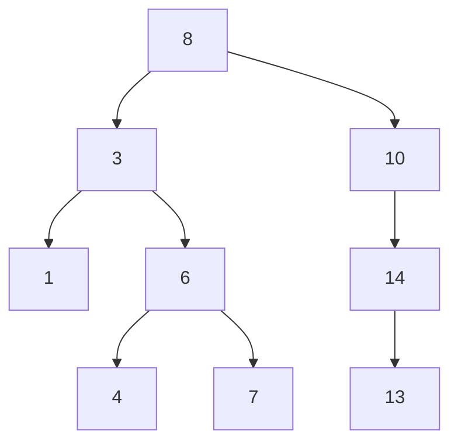
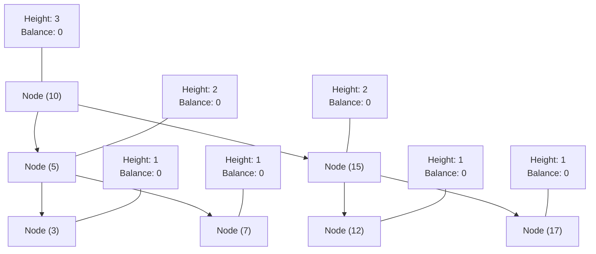
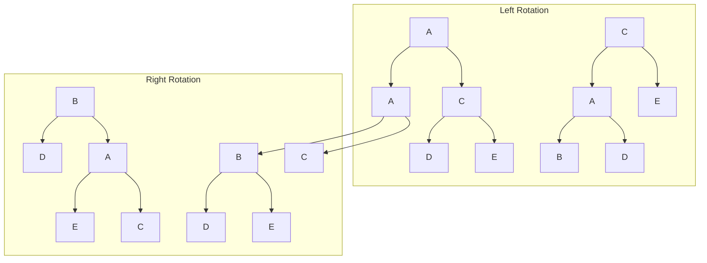

# Tree Data Structures

This document covers various tree data structures, which are hierarchical structures consisting of nodes with parent-child relationships.

## Binary Tree

A binary tree is a tree data structure where each node has at most two children, referred to as the left child and the right child.

### Explanation

Binary trees are fundamental tree structures where each node can have up to two children. Unlike binary search trees, binary trees don't have specific ordering requirements. They're used in various applications, including expression trees, Huffman coding, and as a base for other tree types.

### Visual Representation

### Tree Properties

Our implementation can test if a binary tree is:
- **Balanced**: Height difference between left and right subtrees for any node is at most 1
- **Full**: Each node has either 0 or 2 children
- **Perfect**: All internal nodes have 2 children and all leaves are at the same level
- **Complete**: All levels are filled except possibly the last, which is filled left-to-right

### Time Complexity

| Operation               | Time Complexity |
|-------------------------|----------------|
| Insertion               | O(n)           |
| Search                  | O(n)           |
| Traversal (any method)  | O(n)           |
| Height calculation      | O(n)           |

### Implementation Notes

The implementation supports multiple traversal methods:
- Level-order (breadth-first)
- Inorder (left-root-right)
- Preorder (root-left-right)
- Postorder (left-right-root)

### External Resources

- [Binary Tree - GeeksforGeeks](https://www.geeksforgeeks.org/binary-tree-data-structure/)
- [Binary Tree Visualizer](https://visualgo.net/en/bst)
- [Types of Binary Trees](https://www.programiz.com/dsa/binary-tree)

## Full Binary Tree

A full binary tree is a binary tree where every node has either 0 or 2 children.

### Explanation

In a full binary tree, each node either has no children (leaf node) or has two children. There are no nodes with exactly one child. This structure ensures optimal use of resources in certain algorithms.

### Visual Representation

### Time Complexity

| Operation               | Time Complexity |
|-------------------------|----------------|
| Insertion pair          | O(n) for finding parent + O(1) for insertion |
| Validation              | O(n)           |
| Traversal               | O(n)           |

### Implementation Notes

Our implementation enforces the "full" property by providing a special `insert_pair` method that adds both left and right children at once. It also includes validation to ensure the tree remains full.

### External Resources

- [Full Binary Tree - GeeksforGeeks](https://www.geeksforgeeks.org/full-binary-tree/)
- [Properties of Binary Trees](https://www.cs.cmu.edu/~adamchik/15-121/lectures/Trees/trees.html)

## Binary Search Tree

A binary search tree (BST) is a binary tree where the left subtree of a node contains only nodes with values less than the node's value, and the right subtree contains only nodes with values greater than the node's value.

### Explanation

Binary search trees provide efficient operations due to their ordering property. They support fast lookup, addition, and removal of items, and can be used to implement dynamic sets and lookup tables.

### Visual Representation

### Time Complexity

| Operation   | Average Case | Worst Case |
|-------------|--------------|------------|
| Search      | O(log n)     | O(n)       |
| Insertion   | O(log n)     | O(n)       |
| Deletion    | O(log n)     | O(n)       |
| Min/Max     | O(log n)     | O(n)       |
| Traversal   | O(n)         | O(n)       |

### Implementation Notes

Our BST implementation handles all three deletion cases:
1. Node with no children (leaf node)
2. Node with one child
3. Node with two children (using inorder successor)

### External Resources

- [Binary Search Tree - GeeksforGeeks](https://www.geeksforgeeks.org/binary-search-tree-data-structure/)
- [BST Visualizer](https://visualgo.net/en/bst)
- [Interactive BST](https://www.cs.usfca.edu/~galles/visualization/BST.html)

## AVL Tree

An AVL tree is a self-balancing binary search tree where the height difference between left and right subtrees of any node cannot exceed one.

### Explanation

Named after inventors Adelson-Velsky and Landis, AVL trees automatically maintain balance during insertions and deletions through rotations. They ensure O(log n) time complexity for all operations, preventing the worst-case scenario seen in regular BSTs.

### Visual Representation

### Rotation Types

### Time Complexity

| Operation   | Average Case | Worst Case |
|-------------|--------------|------------|
| Search      | O(log n)     | O(log n)   |
| Insertion   | O(log n)     | O(log n)   |
| Deletion    | O(log n)     | O(log n)   |
| Min/Max     | O(log n)     | O(log n)   |
| Traversal   | O(n)         | O(n)       |

### Implementation Notes

Our AVL tree implementation:
- Maintains a height attribute for each node
- Performs four types of rotations: Left, Right, Left-Right, Right-Left
- Rebalances the tree after each insertion and deletion
- Includes validation to ensure all AVL properties are maintained

### External Resources

- [AVL Tree - GeeksforGeeks](https://www.geeksforgeeks.org/avl-tree-set-1-insertion/)
- [AVL Tree Visualizer](https://www.cs.usfca.edu/~galles/visualization/AVLtree.html)
- [AVL Trees Tutorial](https://www.tutorialspoint.com/data_structures_algorithms/avl_tree_algorithm.htm)
